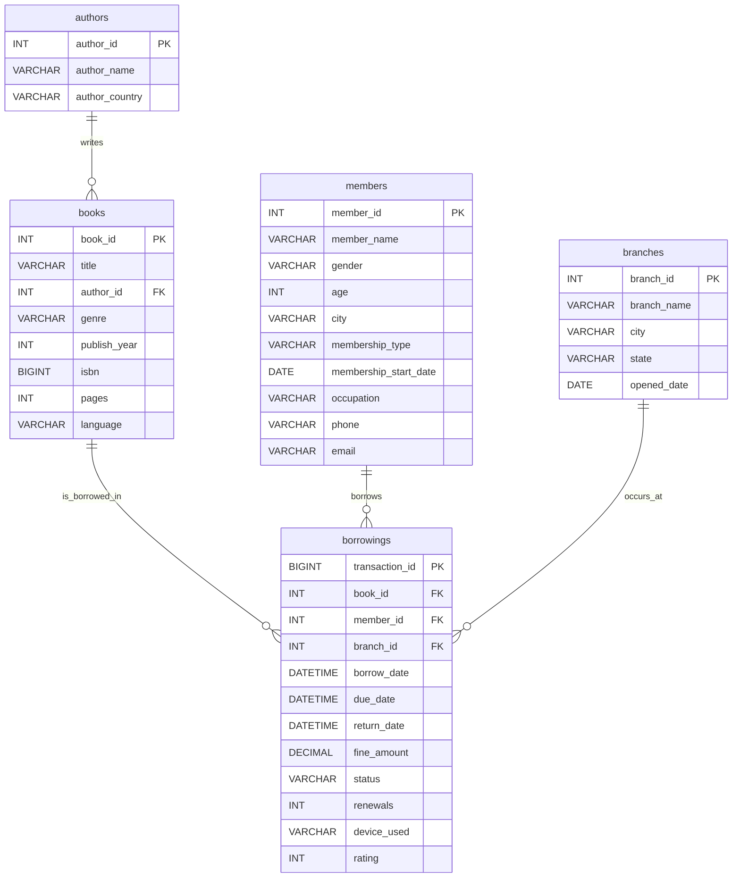

# KnowledgeBase System – SQL Server Analytics Project

This project implements a complete SQL Server–based analytical system using a realistic multi-branch library dataset.
It models and analyzes more than one million borrowing transactions recorded between 2018 and 2024 across ten library branches in India.

The goal of the project is to demonstrate end-to-end database design, large-scale data loading, and analytical querying that supports real business decision-making.

---

## Project Structure

```
KnowledgeBase System/
│
├── schema_knowledgebase.sql        # Database schema (tables, keys, indexes)
├── Load Data.sql                   # BULK INSERT for all CSV datasets
│
├── authors.csv                     # Author details
├── books.csv                       # Book metadata
├── branches.csv                    # Library branch data
├── members.csv                     # Member demographic and membership data
├── borrowings.csv                  # Large historical transactions dataset
│
└── queries/
    └── knowledgebase_queries.sql   # Set of 30 analytical SQL queries
```

---

## Database Schema

The database is organized around five core tables:

* **authors** – Author details
* **books** – Title, genre, publication metadata, linked to authors
* **members** – Demographic details and membership types
* **branches** – Library branch locations and operational data
* **borrowings** – Complete transaction history including due dates, returns, fines, renewals, device used, and optional ratings

These tables are linked through primary and foreign keys to support comprehensive analytical workloads.

---

## ER Diagram (Mermaid Format)



---

## Data Loading

All datasets are loaded using SQL Server’s `BULK INSERT` feature.
The process is defined in `Load Data.sql`, which imports:

* Author records
* Book metadata
* Member data
* Branch information
* Over one million borrowing records

This approach ensures fast ingestion of large CSV files.

---

## Analytical Queries

The project includes a collection of 30 analytical SQL queries located in:

```
queries/knowledgebase_queries.sql
```

These queries cover a wide range of analysis, including:

* Borrowing trends over time
* Genre popularity
* Membership behavior (Regular vs Premium)
* Overdue patterns and fine analysis
* Device usage trends (web, mobile, kiosk)
* Branch-level performance
* Age-group and occupation-based insights
* Loyalty and engagement measures

The queries are written for SQL Server using appropriate indexing and window functions where necessary.

---

## Key Insights

Several meaningful insights were obtained from the analysis:

* Premium members borrow significantly more books than Regular members.
* Roughly 10% of borrowings become overdue, with an average fine of about ₹52.
* Children’s literature, Fiction, and Science emerge as consistently high-demand genres.
* Mobile app usage shows steady growth after 2021 and becomes a major borrowing channel.
* Metro branches have the highest circulation, while smaller cities show higher overdue ratios.

---

## Business Recommendations

Based on these findings, several improvements are suggested:

* Implement automated reminders to reduce overdue returns.
* Increase inventory for high-demand genres and optimize low-circulation categories.
* Strengthen digital channels through mobile app enhancements and self-service kiosks.
* Offer incentives for timely returns and encourage upgrades to Premium membership.
* Provide targeted operational support based on branch performance patterns.

---

## Skills Demonstrated

This project highlights practical experience in:

* SQL Server database design
* Managing large datasets using BULK INSERT
* Writing analytical SQL using joins, aggregates, and window functions
* Performance-aware query design with indexing
* Translating analytical insights into recommendations that support business decisions

---
